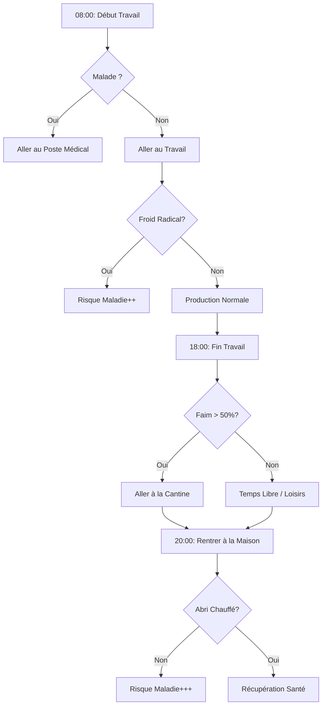

# Document de Spécifications Techniques : Système des Citoyens (Agents)

## 1. Modèle de Données : L'Objet Citoyen
Chaque citoyen est une instance d'une classe `Citizen`, agissant comme un agent autonome.

### 1.1 Attributs de base
| Champ | Type | Description |
| :--- | :--- | :--- |
| `citizen_id` | String | Identifiant unique. |
| `type` | Enum | `WORKER`, `ENGINEER`, `CHILD`. |
| `age_group` | Enum | `ADULT`, `CHILD`. |
| `state` | Enum | `IDLE`, `WORKING`, `EATING`, `SLEEPING`, `BUILDING`, `TREATING`. |
| `health_status` | Enum | `HEALTHY`, `SICK`, `GRAVELY_ILL`, `AMPUTEE`, `DEAD`. |
| `hunger_level` | Float | De 0.0 (repattu) à 1.0 (affamé/mort). |
| `workplace_id` | String | ID du bâtiment où il est affecté. |
| `home_id` | String | ID du bâtiment où il dort. |

## 2. Machine à États de Santé (Health State Machine)
La santé dépend directement du Système de Température.

### 2.1 Algorithme de Maladie
À chaque cycle horaire, le système calcule la probabilité de tomber malade selon la température du lieu actuel (travail ou maison).

**Transitions d'états :**
- **Healthy → Sick** : Exposition au froid.
- **Sick → Gravely Ill** : Si non soigné en centre médical après 24h.
- **Gravely Ill → Dead** : Si non soigné après 24h (ou manque de technologie "Soutien Vital").
- **Amputation** : Résultat possible d'un traitement radical sur un `Gravely Ill`.

## 3. Système de Travail et d'Affectation

### 3.1 Gestion des Groupes (Pools)
- **Affectation** : Le système puise dans les agents `IDLE` de type requis pour les assigner à un `workplace_id`.
- **Remplacement automatique** : En cas de décès ou maladie, le système tente de réaffecter des agents libres pour maintenir l'efficacité.

### 3.2 Cycle de Journée (Schedule)
- **08:00 - 18:00 (Travail)** : Déplacement vers `workplace_id`. Priorité à la tâche `BUILDING` si nécessaire.
- **18:00 - 20:00 (Temps Libre)** : Déplacement vers la Cantine (`Cookhouse`) puis zones de loisirs.
- **20:00 - 08:00 (Repos)** : Déplacement vers `home_id`. Si sans abri, dort près du Générateur.

## 4. Besoins : Faim et Logement

### 4.1 La Faim
- Consommation : 1 Ration par jour.
- **Starving** : Après 2 jours sans ration, l'agent quitte son poste pour manger de la nourriture crue au stock (risque de maladie accru).

### 4.2 Le Logement
- Chaque citoyen est mappé à un bâtiment de type `Home`.
- **Homeless** : Si aucune place disponible, l'agent subit la température ambiante toute la nuit.

## 5. Dynamique Sociale : Espoir et Mécontentement
| Action | Impact Espoir | Impact Mécontentement |
| :--- | :--- | :--- |
| Décès d'un citoyen | -- | ++ |
| Citoyen affamé | - | + |
| Logement chauffé | + | - |
| Promesse tenue | ++ | -- |

## 6. Logique de Déplacement (Pathfinding)
- **Navigation** : Utilisation de la grille radiale.
- **Vitesse** : Réduite par la neige profonde, augmentée par les routes (`Road`).
- **Visualisation** : En cas de bug de pathfinding, l'agent se téléporte à destination pour ne pas bloquer la simulation économique.

## 7. Schéma de Flux : "Une journée de Citoyen"

## 8. Spécifications UI (Citizen Info Panel)
- **Status Bar** : Santé, Faim, Sommeil.
- **Lieu actuel** : Travail et Habitation.
- **Pensées (Flavour Text)** : Phrases basées sur l'état des jauges sociales et individuelles.
