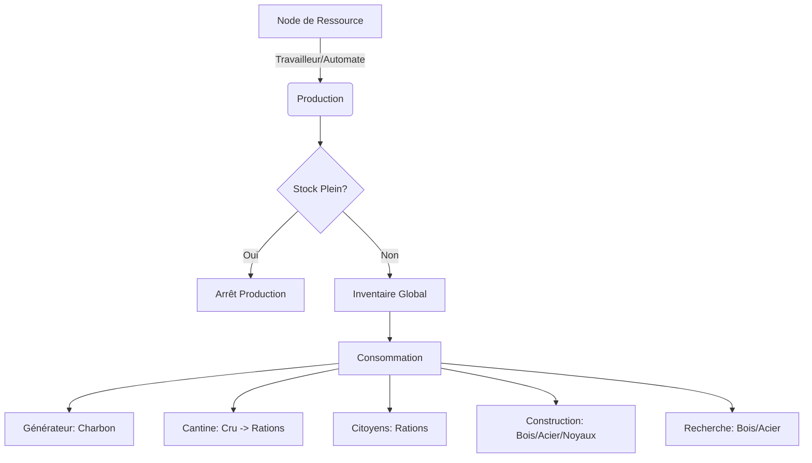

# Document de Spécifications Techniques : Système d'Économie et Ressources

## 1. Modèle de Données : Les Types de Ressources
Le système distingue trois catégories de ressources : les Matières Premières, les Consommables et les Ressources Rares.

### 1.1 Table des Ressources
| Ressource | Type | Source Primaire | Usage Principal |
| :--- | :--- | :--- | :--- |
| **Charbon** | Consommable | Mine, Extracteur, Tas | Chauffage (Générateur/Hubs) |
| **Bois** | Matière Première | Scierie, Caisse en bois | Construction, Recherche, Lois |
| **Acier** | Matière Première | Aciérie, Débris ferreux | Construction avancée, Recherche |
| **Noyau de Vapeur** | Rare (Fini) | Exploration (Scouts) | Bâtiments avancés, Automates |
| **Cru (Raw Food)** | Matière Première | Chasseurs, Serres | Transformation en Rations |
| **Rations** | Consommable | Cantine (Cookhouse) | Alimentation des citoyens |

## 2. Logique de Production et Collecte

### 2.1 Modes de Collecte
- **Collecte Directe (Tas au sol)** : Travail direct sur un objet `ResourcePile` (inefficace et dangereux).
- **Poste de Collecte (Gathering Post)** : Bâtiment qui "aspire" les ressources des tas environnants.
- **Extraction Industrielle** : Bâtiments sur nodes infinis (Mines, Aciéries) ou producteurs (Serres).

### 2.2 Calcul du Rendement (Output Formula)
`Production_Horaire = Base_Rate * Efficiency_Global`

`Efficiency_Global = (Staff_Present / Staff_Max) * Efficiency_Tech * Efficiency_Laws * Condition_Modifier`

- **Condition_Modifier** : Chute si le bâtiment est "Très Froid", stop à 0 si "Glacial".

## 3. La Chaîne de Transformation (Food Logic)
- **Étape 1 : Récolte** : Les `Hunter's Huts` produisent du `Raw Food` durant la nuit.
- **Étape 2 : Transformation** : La `Cookhouse` transforme le `Raw Food` en `Rations`.
    - Ratio de base : 1 Cru = 2 Rations.
    - Loi "Soupe" : 1 Cru = 2.5 Rations (Mécontentement++).
    - Loi "Additifs" : 1 Cru = 3 Rations (Risque Maladie++).

## 4. Gestion du Stockage (Storage & Depots)
Le stockage est limité et nécessite des infrastructures dédiées.

### 4.1 Capacité Globale
- **Base_Capacity** par défaut.
- **Overflow_State** : Production stoppée si le stock est plein.
- **Dépôts de Ressources (Resource Depots)** : Bâtiments modulaires configurables pour un seul type de ressource.

### 4.2 Script de Capacité (Logique)
```javascript
function canProduce(type) {
    let current = GlobalInventory.getAmount(type);
    let max = GlobalInventory.getMaxCapacity(type);
    return current < max;
}
```

## 5. Le Système de Noyaux de Vapeur (Steam Cores)
- **Non-reproductible** : Uniquement via l'exploration.
- **Récupérable** : Remboursé à 100% lors de la déconstruction d'un bâtiment utilisateur.

## 6. Flux Économique (Resource Flow Chart)



## 7. Interface Utilisateur (Economy UI)

### 7.1 La Barre de Ressources (Top Bar)
- Visualisation : `Quantité actuelle / Capacité max`.
- **Indicateur de Tendance** : Flèche ou chiffre indiquant le delta net horaire (+X / -Y).

### 7.2 Le Panneau Économique (Détails)
- Graphique de consommation (Générateur vs Steam Hubs vs Radiateurs).
- Répartition nourriture (Rations mangées vs produites).
- Logistique (Citoyens affectés par ressource).

## 8. API et Événements pour les Développeurs
- `ModifyResource(ResourceType type, int amount)` : Ajout/soustraction.
- `GetDailyTrend(ResourceType type)` : Projection à 24h.
- `OnResourceDepleted(NodeID id)` : Signal de tas vide.
- `SetStorageConfiguration(DepotID id, ResourceType type)` : Configuration de dépôt.
