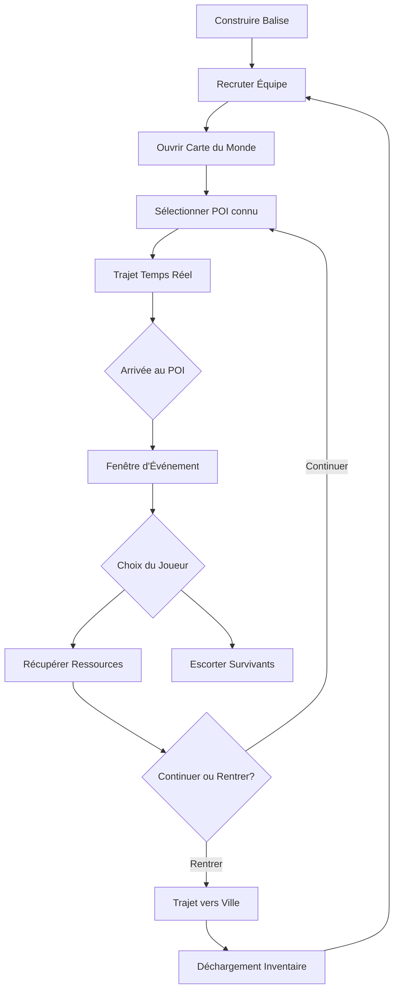

# Document de Spécifications Techniques : Système d'Exploration (Scouts)

## 1. Modèle de Données : La Carte du Monde et les POI
Le monde extérieur est représenté par un graphe de Points d'Intérêt (POI).

### 1.1 Structure d'un Point d'Intérêt (POI)
| Champ | Type | Description |
| :--- | :--- | :--- |
| `poi_id` | String | Identifiant unique. |
| `name` | String | Nom affiché (ex: "Convoi abandonné"). |
| `coordinates` | Vector2 | Position sur la carte 2D. |
| `state` | Enum | `HIDDEN`, `KNOWN`, `EXPLORED`, `DEPLETED`. |
| `event_id` | String | ID de l'événement narratif/script associé. |
| `discovery_source` | List[ID] | IDs des POI qui révèlent celui-ci. |
| `is_outpost_spot` | Boolean | Si `true`, un avant-poste peut y être établi. |

### 1.2 Structure de l'Équipe d'Éclaireurs (Scout Team)
| Champ | Type | Description |
| :--- | :--- | :--- |
| `scout_id` | String | Identifiant de l'équipe. |
| `status` | Enum | `IDLE_IN_CITY`, `TRAVELING`, `EXPLORING`, `RETURNING`. |
| `current_node` | ID | POI actuel ou dernier POI visité. |
| `target_node` | ID | POI de destination. |
| `travel_progress` | Float | Progression entre 0.0 et 1.0. |
| `inventory` | Dictionary | Ressources collectées par l'équipe. |
| `speed_multiplier` | Float | Modificateur de vitesse (via recherche Tech). |

## 2. Le Bâtiment "Balise" (The Beacon)
L'exploration nécessite la construction et l'activation du bâtiment `Beacon`.
- **Fonction** : Passerelle entre la ville et la carte du monde.
- **Coût d'activation** : Ressources (ex: 40 bois) + 5 citoyens (Ouvriers).
- **Limite** : Nombre max d'équipes dicté par les technologies.

## 3. Logique de Navigation (Travel Logic)

### 3.1 Calcul du temps de trajet
`Temps_Trajet = Distance(A, B) / (Vitesse_Base * Multiplicateur_Tech)`

- **Trajet connu** : Vitesse augmentée (ex: x1.5) vers des points déjà visités ou la ville.

### 3.2 Brouillard de Guerre (Fog of War)
- Découverte : Arriver au POI A débloque les nœuds liés (`UnlockLinkedNodes(A)`), passant leur état de `HIDDEN` à `KNOWN`.

## 4. Événements d'Exploration (Encounter Logic)
Une fois au POI (`travel_progress == 1.0`), l'état passe à `EXPLORING` (timer de 2h-4h in-game).

### 4.1 Types de résultats
- **Ressources** : Ajout à l'inventaire de l'équipe.
- **Survivants** :
    - Option A (Escorte) : Sécurité garantie, vitesse de retour réduite.
    - Option B (Envoyer seuls) : Scouts libres, risque de mort (X%) pour les survivants.
- **Avant-poste** : Permet de générer des ressources quotidiennes via une équipe spéciale.

## 5. Flux de l'Exploration (Expedition Loop)

## 6. Spécifications de l'Interface (World Map UI)

### 6.1 La Vue Carte
- **Caméra** : Vue de dessus avec shader de tempête de neige.
- **Marqueurs** : Point d'exclamation (Nouveau), Check (Vidé), Icône Scout (Position).

### 6.2 Le Panneau d'Événement
- Illustration large, texte d'ambiance et boutons d'action scriptés.

## 7. Risques et Variables (Game Balance)
- **Inventaire Perdu** : Si l'équipe meurt ou est dissoute, le butin est perdu.
- **Timer de Tempête** : En fin de partie, l'exploration est désactivée ; les scouts dehors doivent rentrer d'urgence.

## 8. API pour les Développeurs
- `SendScout(team_id, target_poi_id)` : Initialise le mouvement.
- `OnScoutArrived(team_id, poi_id)` : Déclenche l'UI d'événement.
- `ReturnToCity(team_id)` : Retour automatique.
