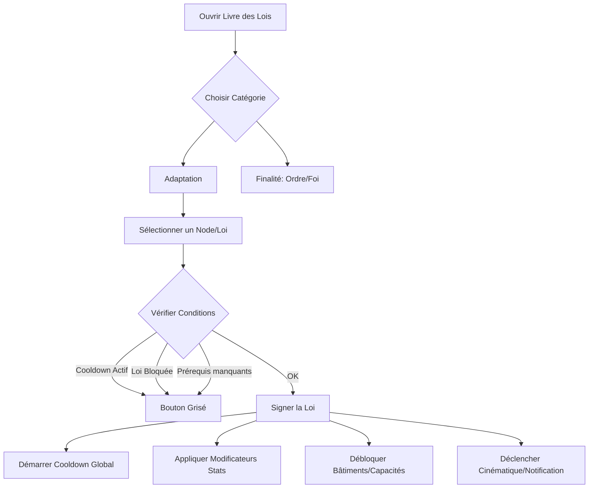

# Document de Spécifications Techniques : Système du Livre des Lois

## 1. Architecture des Données (Data Model)
Chaque loi doit être traitée comme un objet (ou une entrée de base de données) avec les attributs suivants :

### 1.1 Structure d'une Loi (JSON Schema type)
| Champ | Type | Description |
| :--- | :--- | :--- |
| `law_id` | String | Identifiant unique (ex: `law_child_labour_safe`). |
| `category` | Enum | `ADAPTATION`, `ORDER`, `FAITH`. |
| `title` | String | Nom affiché dans l'UI. |
| `requirements` | List[ID] | IDs des lois devant être signées avant celle-ci. |
| `mutually_exclusive` | List[ID] | IDs des lois qui deviennent bloquées si celle-ci est signée. |
| `cooldown_hours` | Int | Temps (en heures de jeu) avant de pouvoir signer une autre loi (défaut: 18h). |
| `passive_effects` | List[Obj] | Modificateurs permanents (ex: `hope_bonus: +10%`). |
| `active_abilities` | List[ID] | IDs des capacités débloquées (ex: `ability_emergency_shift`). |
| `unlocked_buildings` | List[ID] | IDs des bâtiments constructibles suite à la loi. |
| `on_sign_event` | ID | Référence vers un script ou dialogue qui se déclenche à la signature. |

## 2. Logique de Jeu (Backend Logic)

### 2.1 Gestion de l'Arborescence
Le système doit gérer un Graphe Acyclique Dirigé (DAG).
- **Vérification de validité** : Une loi ne peut être signée que si `requirements` est rempli ET `mutually_exclusive` est vide pour cette branche.
- **Verrouillage** : Lorsqu'une loi est signée, toutes les lois dans sa liste `mutually_exclusive` doivent passer au statut `LOCKED_PERMANENTLY`.

### 2.2 Le Système de Cooldown
- **Variable globale** : `GlobalLawCooldown` (Timer).
- **Comportement** : À la signature, `GlobalLawCooldown = law.cooldown_hours`. Tant que `GlobalLawCooldown > 0`, l'interaction avec le bouton "Signer" de n'importe quelle autre loi est désactivée.

### 2.3 Calcul des Impacts Sociaux
Les lois impactent deux jauges globales : l'Espoir et le Mécontentement.
- **Impact Instantané** : `on_sign_impact` (ex: +20% Mécontentement).
- **Impact Contextuel** : Certaines lois changent la réaction des citoyens aux événements futurs (ex: la loi "Cimetière" réduit la perte d'espoir lors d'un décès).

## 3. Schéma de Flux (Logic Flow)

## 4. Spécifications de l'Interface (UI/Frontend)
Le "Livre des Lois" n'est pas une simple liste, c'est une carte interactive.

### 4.1 Éléments Visuels requis
- **Le Canevas de l'Arbre** :
    - Les nodes (lois) sont reliés par des lignes.
    - **État Visuel 1 (Disponible)** : Icône brillante.
    - **État Visuel 2 (Signée)** : Icône dorée/scellée avec tampon de cire.
    - **État Visuel 3 (Verrouillée)** : Icône barrée ou assombrie.
- **Le Panneau de Détails (Side Panel)** :
    - Texte de "Flavour" (le contexte narratif).
    - Liste des effets "Pour" (Positifs) et "Contre" (Négatifs).
    - Bouton de confirmation large.
- **Indicateur de Progression** : Une barre montrant à quel point on s'est enfoncé dans l'extrémisme (ex: indicateur "Crossing the Line").

## 5. Liste des Catégories de Lois (Référence Wiki)
Pour reproduire le contenu, les développeurs devront implémenter ces groupes :

### Groupe A : Adaptation (Survie immédiate)
| Sous-groupe | Exemples de Lois | Mécaniques clés |
| :--- | :--- | :--- |
| **Travail** | Enfant (Abri vs Mine) | Main d'œuvre vs Espoir. |
| **Santé** | Traitement radical vs Maintien en vie | Gestion des amputés (Prothèses). |
| **Nourriture** | Soupe vs Additifs alimentaires | Ratio ressources / mécontentement. |
| **Cadavres** | Cimetière vs Fosse commune | Hygiène vs Respect des morts. |

### Groupe B : Finalité (Contrôle social tardif)
- **Voie de la Foi** : Focus sur l'Espoir. Bâtiments : Maison de prière, Temples, Inquisiteurs.
- **Voie de l'Ordre** : Focus sur le Mécontentement. Bâtiments : Postes de garde, Prisons, Centres de propagande.

## 6. Variables Techniques à Exposer (API interne)
Le module "Lois" doit pouvoir envoyer des signaux aux autres systèmes :
- `OnLawSigned(LawID)` : Alerte le système de construction pour activer de nouveaux Blueprints.
- `GetModifier(StatID)` : Le système de travail appelle cette fonction pour savoir si la loi "Emergency Shift" est active.
- `IsLawActive(LawID)` : Utilisé par le système d'événements aléatoires pour filtrer les dialogues.

## 7. Notes pour l'équilibrage (Design Notes)
- **Lois de "non-retour"** : Certaines lois (ex: "New Order" ou "New Faith") suppriment totalement la jauge d'Espoir. Le code doit prévoir un override de l'UI pour masquer la jauge une fois ces lois activées.
- **Pénitence** : Prévoir une fonction de "Promesse" : si un joueur signe une loi suite à une demande, il doit y avoir un timer caché pour vérifier si les conditions de la loi des lois sont respectées (ex: construire 3 abris après avoir signé la loi sur le logement).
