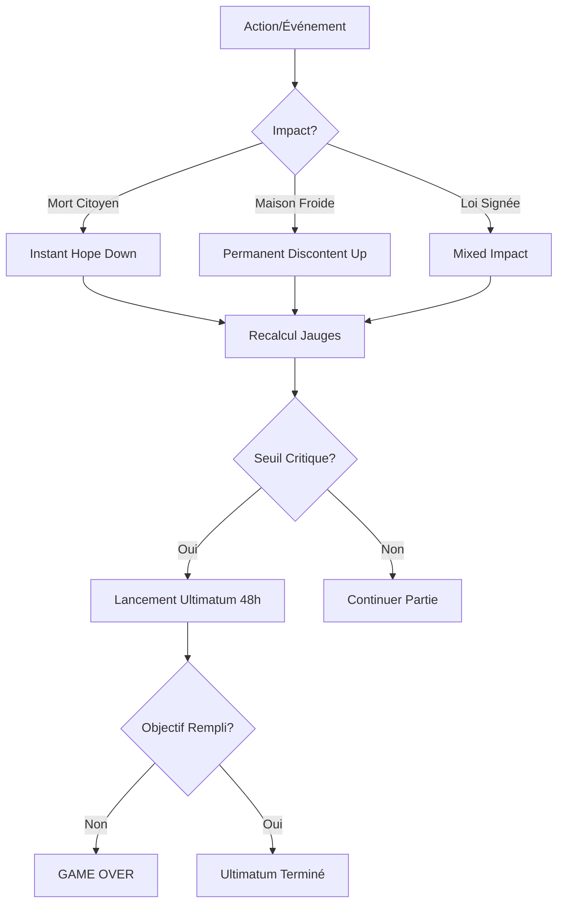

# Document de Spécifications Techniques : Système d'Espoir et de Mécontentement

## 1. Modèle de Données : Les Jauges Sociales
Le système repose sur deux variables flottantes globales (0.0 à 1.0) qui agissent comme les barres de vie du joueur (le Capitaine).

### 1.1 La Jauge d'Espoir (Hope)
- **Logique** : Représente la foi en l'avenir.
- **0.0 (Vide)** : Déclenche l'ultimatum de déposition (Exil).
- **1.0 (Pleine)** : Bonus de motivation (optionnel).

### 1.2 La Jauge de Mécontentement (Discontent)
- **Logique** : Représente la colère immédiate et le stress.
- **1.0 (Pleine)** : Déclenche l'ultimatum de révolte (Exécution).
- **0.0 (Vide)** : Stabilité totale.

### 1.3 Structure d'un Modificateur (Modifier Object)
Les jauges sont influencées par des modificateurs persistants ou temporaires.

| Champ | Type | Description |
| :--- | :--- | :--- |
| `source_id` | String | Origine (ex: `modifier_cold_homes`, `modifier_extra_rations`). |
| `target_gauge` | Enum | `HOPE` ou `DISCONTENT`. |
| `value` | Float | Valeur de l'impact (ex: -0.15). |
| `is_permanent` | Boolean | Si false, le modificateur disparaît après `duration_hours`. |
| `description` | String | Texte affiché dans l'infobulle. |

## 2. Logique de Calcul (Social Engine)

### 2.1 Calcul de la Valeur Actuelle
`Valeur_Finale = Somme(Modificateurs_Permanents) + Somme(Modificateurs_Temporaires_Actifs)`

### 2.2 Sensibilité (Weighting)
- **Impulsion** (`AddInstantImpact`) : Certains événements (mort d'un citoyen) provoquent un pic immédiat qui se résorbe lentement vers la valeur d'équilibre.

## 3. Le Système de Ultimatum (Loss Condition Logic)
Mécanique de "dernière chance" déclenchée si `Hope <= 0` ou `Discontent >= 1.0`.

- **Lancement** : Timer de 48h (in-game).
- **Objectif** : Remonter l'espoir ou baisser le mécontentement sous un seuil (ex: 15% / 75%).
- **Résolution** : 
    - **Succès** : Timer arrêté, cooldown appliqué.
    - **Échec** : Game Over (Exil ou Mort).

## 4. Système de Promesses (Promises & Demands)
- **Structure** : Condition (ex: chauffer 5 maisons) + Délai (ex: 24h).
- **Récompense** : Boost massif d'Espoir.
- **Pénalité** : Chute d'Espoir et hausse de Mécontentement.

## 5. Manipulation via la Finalité (Order vs Faith)
- **Ordre (Peur)** : Remplace l'Espoir par l'Obéissance ou réduit le Mécontentement par la force (Prisons).
- **Foi (Dévotion)** : Augmente massivement l'Espoir via des rituels et des buffs de zone.

## 6. Flux des Événements Sociaux (Logic Flow)

## 7. Spécifications UI (Social UI)
- **Barre d'Espoir (Bleue)** : Bas gauche.
- **Barre de Mécontentement (Rouge)** : Bas droite.
- **Feedback** : Animation d'ombre blanche lors d'un changement.
- **Infobulle (Tooltip)** : Liste détaillée des modificateurs actifs (+ et -).

## 8. API et Fonctions Développeurs
- `AdjustHope(float amount, string reason, bool isPermanent)`
- `AdjustDiscontent(float amount, string reason, bool isPermanent)`
- `TriggerUltimatum(ConditionType type)`
- `CheckPromises()` : Vérification horaire des conditions de promesses.
