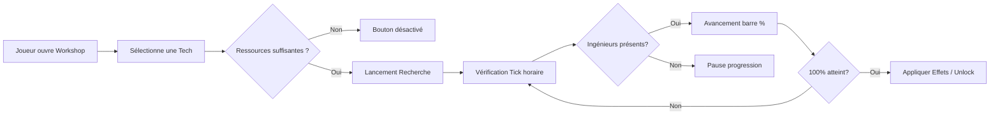

# Document de Spécifications Techniques : Arbre Technologique (Tech Tree)

## 1. Modèle de Données (Tech Data Structure)
Le système repose sur une collection de `TechNodes` organisés par catégories et par paliers (Tiers).

### 1.1 Structure d'une Technologie
| Champ | Type | Description |
| :--- | :--- | :--- |
| `tech_id` | String | ID unique (ex: `tech_heaters_efficiency_1`). |
| `category` | Enum | `HEATING`, `RESOURCES`, `EXPLORATION`, `FOOD_HEALTH`. |
| `tier` | Int | Niveau d'expertise requis (0 à 5). |
| `cost` | Dictionary | Coût (Bois, Acier, Noyaux de vapeur). |
| `base_research_time` | Float | Temps de recherche de base (en heures de jeu). |
| `prerequisites` | List[ID] | IDs des technologies parentes nécessaires. |
| `effects` | List[Obj] | Références aux modifications (ex: `unlock_building`, `stat_modifier`). |

## 2. Le Moteur de Recherche (The Workshop Logic)
La recherche ne se fait pas "par magie" ; elle nécessite des bâtiments (Workshops) et du personnel (Engineers).

### 2.1 Calcul de la Vitesse de Recherche
La vitesse de recherche subit des rendements décroissants selon le nombre d'ateliers actifs.

**Formule type (Diminishing Returns) :**
- 1 Atelier : 100% de vitesse.
- 2 Ateliers : 130% (100 + 30).
- 3 Ateliers : 150% (130 + 20).
- 4 Ateliers et plus : +10% par atelier supplémentaire.

`Vitesse_Globale = Bonus_Premier + Bonus_Second + Bonus_Troisième + (N * 10%)`

### 2.2 État de la Recherche
- **Une seule recherche peut être active à la fois.**
- **Mise en pause** : Si les ingénieurs quittent l'atelier (nuit, maladie, réaffectation), la progression (`current_progress_hours`) est sauvegardée mais n'avance plus.
- **Multiplicateurs** : L'efficacité peut être boostée par des capacités (ex: "Extra Shifts" du Livre des Lois).

## 3. Système de Paliers (Tiers)
L'arbre est divisé horizontalement (ou verticalement) en Tiers.
- **Verrouillage de Tier** : Pour accéder aux technologies du Tier 1, le joueur doit d'abord rechercher la technologie spéciale "Tier Upgrade 1".
- **Coût des Paliers** : Ces recherches de transition sont généralement très coûteuses en ressources et en temps.
- **UI** : Les Tiers non débloqués sont visuellement grisés ou séparés par une ligne de démarcation.

## 4. Architecture de l'Interface (Tree UI)

### 4.1 Navigation
- **Scrolling** : Vue panoramique (Canvas 2D) permettant de naviguer entre les 4 grandes catégories.
- **Liaisons** : Les lignes entre les technologies indiquent les dépendances.
    - Ligne Pleine : Prérequis direct.
    - Ligne Pointillée : Lien thématique ou optionnel.

### 4.2 Feedback Visuel
- **En cours** : Un cercle de progression (Radial Fill) sur l'icône de la technologie.
- **Complétée** : Icône dorée ou illuminée.
- **Achetée mais non recherchée** : Icône en attente.

## 5. Logique d'Application des Effets (Post-Research)
Une fois `current_progress_hours >= base_research_time`, le système déclenche un événement `OnResearchComplete`.

| Type d'effet | Action Technique |
| :--- | :--- |
| **Unlock Building** | Ajoute le `building_id` à la liste des structures constructibles (UI Menu). |
| **Stat Modifier** | Injecte un bonus dans le système cible (ex: `Generator.fuel_consumption *= 0.9`). |
| **Ability Unlock** | Active un bouton de capacité dans l'interface d'un bâtiment ou du menu principal. |
| **Passive Global** | Ex: Augmentation de la capacité d'inventaire des collecteurs de ressources. |

## 6. Schéma de Flux (Technical Flow)

## 7. Variables d'Équilibrage (Config File)
- `research_efficiency_curve` : Tableau des bonus par atelier supplémentaire.
- `engineer_work_hours` : Définit la plage horaire (ex: 08:00 - 18:00).
- `base_tier_costs` : Prix standard pour débloquer chaque niveau de technologie.
